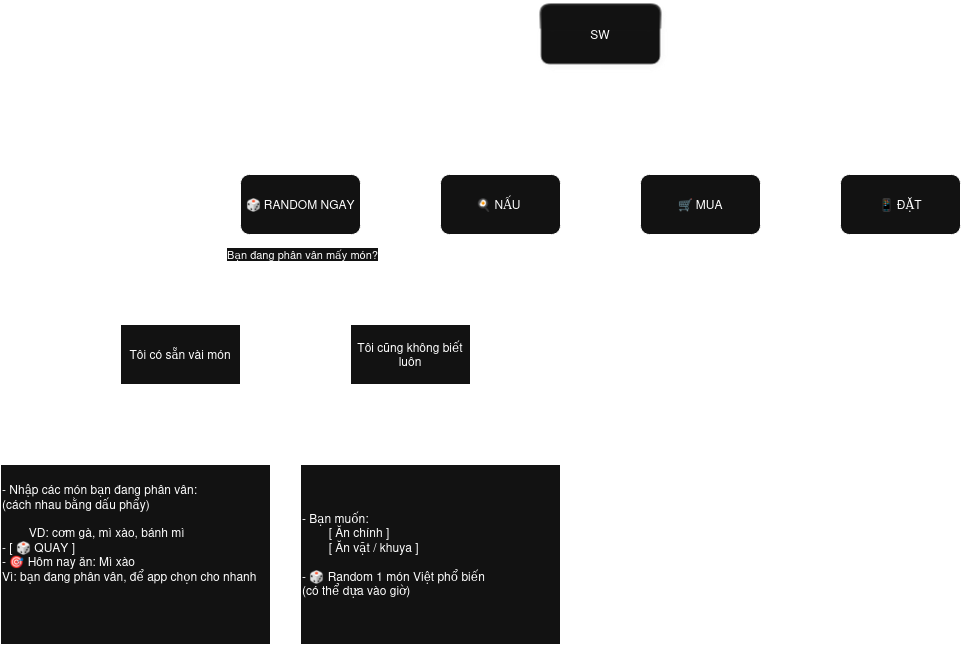

# Rule
- R1: Ưu tiên input người dùng (random trong danh sách nhập)

- R2: Không input → random data hệ thống
  - Sau 20h → ưu tiên tag nhe / nong
  - Sau 22h → hạn chế qua_no
  - Ưu tiên type = mua / dat (mua hoặc đặt)
  - Tránh món nấu phức tạp

- R3: Luôn có câu “giải tỏa trách nhiệm”


- Nếu trường **cookingTip** *null* thì hiển thị: 

```sh
💡 Mẹo:
Món này làm khá đơn giản.

```

- Nguyên tắc:

> **cookingTip**: 1 câu duy nhất  
> **recipeLink**: optional, mở tab mới

- Triển khai 2 phần mềm riêng biệt:

```
[ Decide App ]  --->  [ Recipe App ]
     |                   |
  quyết định          học nấu

```

